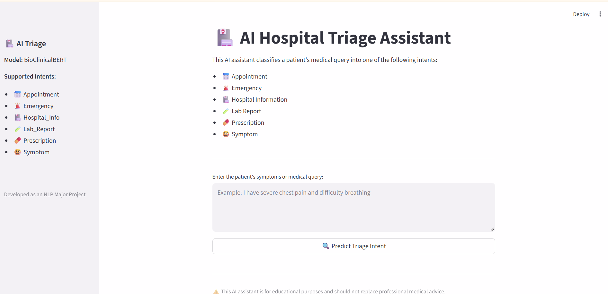
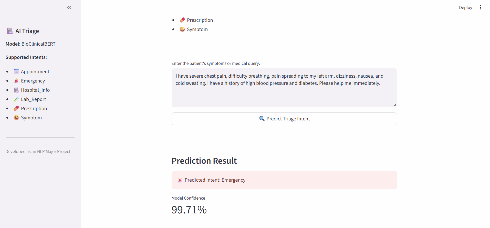

# 🏥 AI Hospital Triage Assistant

> **An NLP-powered hospital triage system that classifies patient symptom descriptions into medical intents using BioClinicalBERT.**


---

## 📌 Project Overview

Hospitals receive thousands of patient queries every day. Manually identifying whether a patient needs emergency care, an appointment, a prescription, or hospital information is time-consuming.

This project uses **BioClinicalBERT**, a medical-domain transformer model, to automatically classify a patient's symptom description into the appropriate medical intent.

---

## 📸 Application Screenshots

### Home Page

Patients can enter their symptoms in natural language.



### Prediction Result

The model predicts the patient's medical intent along with its confidence score.



---

## 🎯 Supported Medical Intents

- 🚨 Emergency
- 🤒 Symptom
- 📅 Appointment
- 💊 Prescription
- 🧪 Lab Report
- 🏥 Hospital Information

---

## ⚙️ Technologies Used

| Category | Technology |
|----------|------------|
| Language | Python |
| NLP Model | BioClinicalBERT |
| Framework | Hugging Face Transformers |
| Deep Learning | PyTorch |
| Data Processing | Pandas, NumPy |
| Deployment | Streamlit |
| Development | Jupyter Notebook |

---

## 🔄 Project Workflow

1. Data Understanding
2. Data Annotation
3. Text Preprocessing
4. Tokenization using BioClinicalBERT
5. Fine-tuning the Transformer Model
6. Intent Prediction
7. Streamlit Deployment

---

## 🌍 Real-World Applications

- AI Hospital Reception Systems
- Telemedicine Platforms
- Medical Chatbots
- Emergency Patient Routing
- Healthcare NLP Solutions

---

## 📁 Repository Structure

```text
AI-Hospital-Triage-Assistant/
│
├── assets/
│   ├── home.png
│   └── prediction.png
│
├── models/
├── notebooks/
├── app.py
├── requirements.txt
└── README.md
```

---

## 👨‍💻 Author

**Saiprasad Nukala**

- GitHub: https://github.com/saiprasad00700
